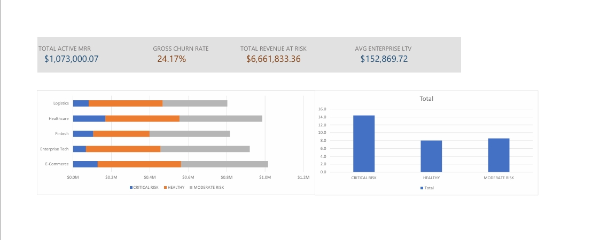

# saas-churn-revenue-analytics 
# SaaS Revenue Retention & Churn Risk Analytics Audit

## Executive Dashboard

## Overview
This project provides an end-to-end audit of recurring revenue risk, customer churn metrics, and account health exposure for a SaaS business model. The interactive model identifies key revenue loss drivers and categorizes accounts into distinct churn risk tiers.

## Key Insights
* **Revenue Exposure:** Analyzed active MRR against churned accounts to evaluate net revenue retention.
* **Risk Scorecard:** Standardized risk metrics based on customer support ticket volume and contract status.
* **Cohort & LTV Analysis:** Evaluated account tenure and lifetime value patterns to identify drop-off points.

## Project Deliverables
* **Interactive Model:** Download `SaaS_Revenue_Retention_&_Churn_Model.csv` to explore the full dashboard, pivot tables, and dynamic risk logic.
* **Executive Report:** Open `SaaS_Churn_Risk_Audit_Executive_Rep.pdf` for complete methodology, formulas, and actionable strategic recommendations
